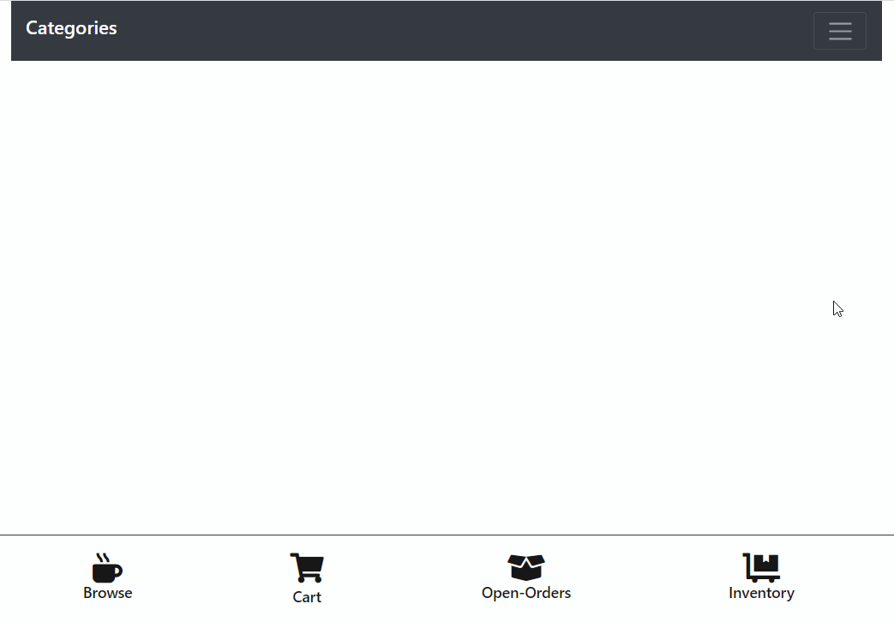
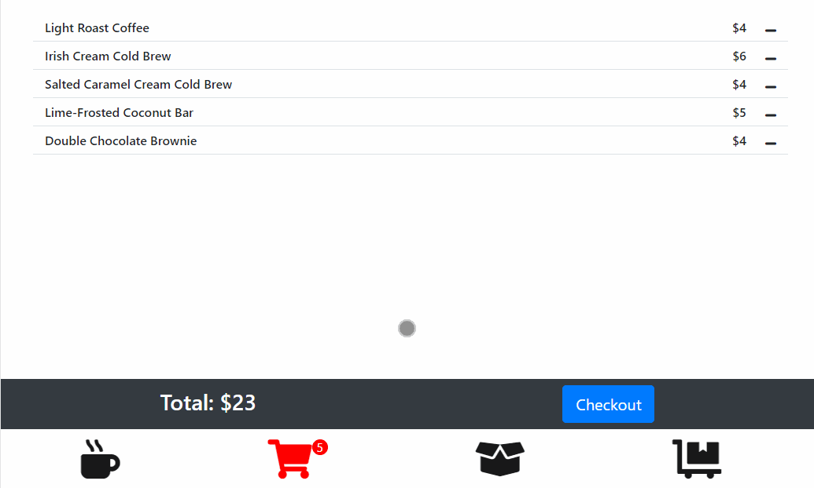
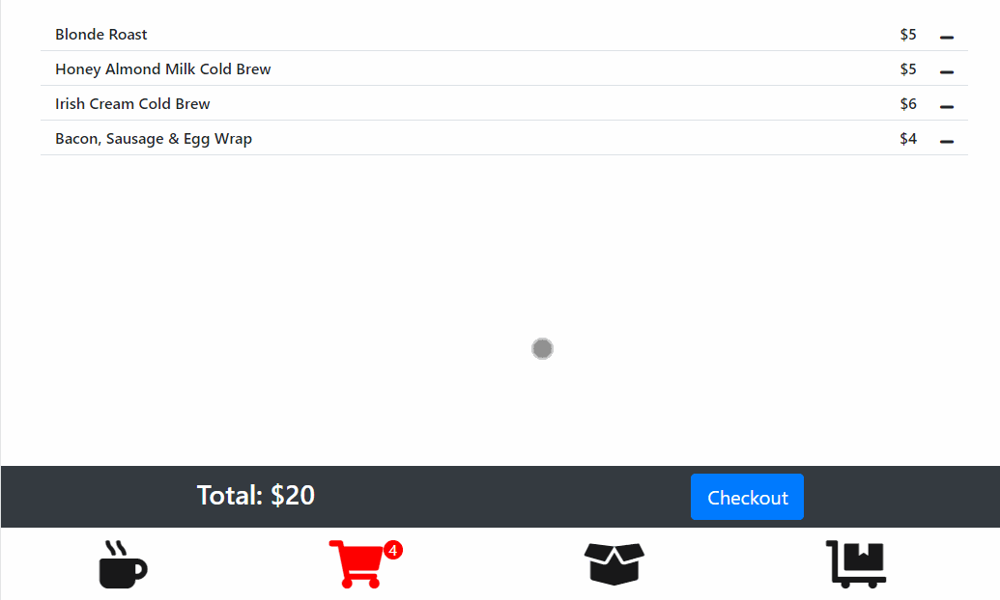
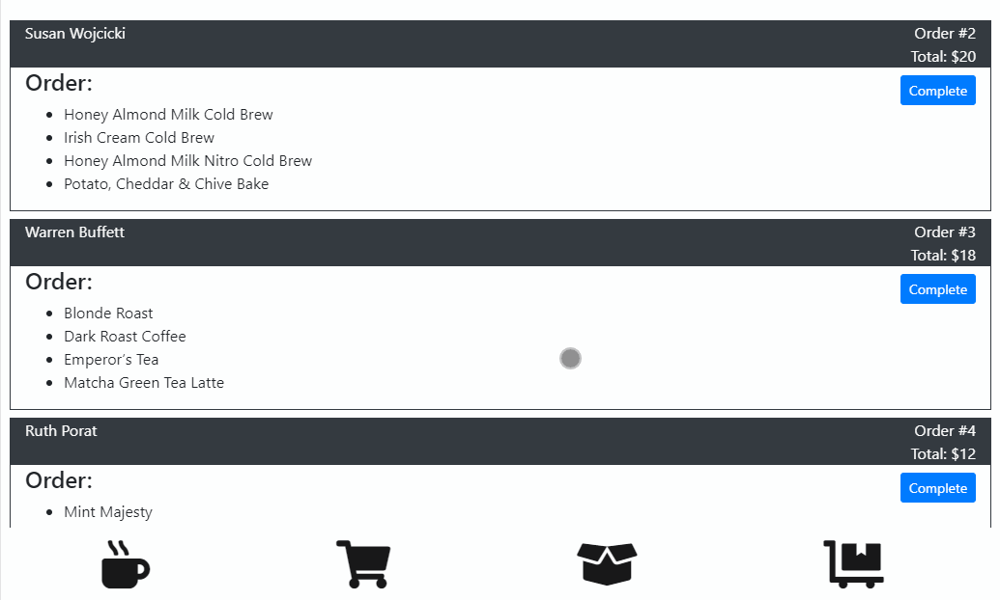
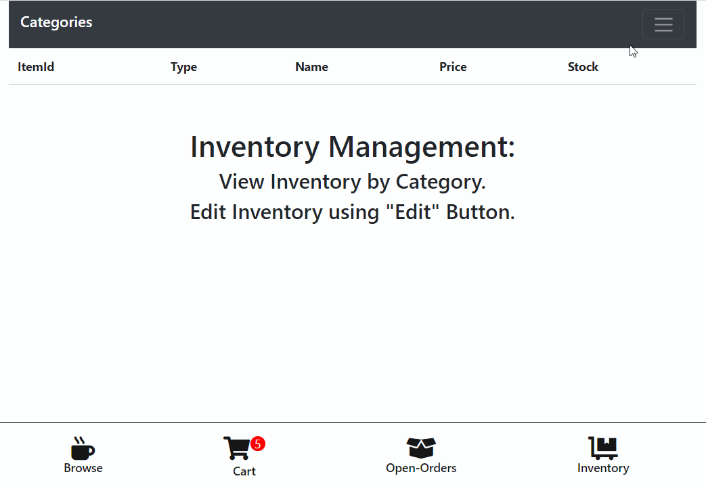
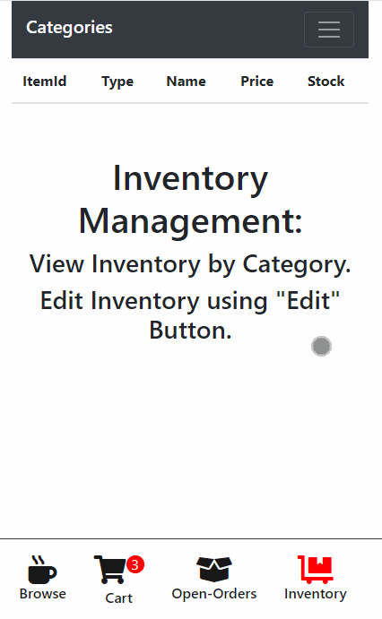
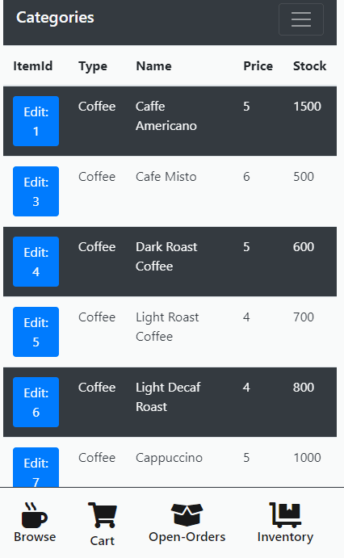

# Point of Sale and Inventory Management Application

A full stack JavaScript solo project.

If you have ever ordered coffee from a botique coffee shop, you have used a similiar application. They are typically deployed on a white tablet that does a gymnastic flip when it is time to finalize your order with a tip and a signature. POS and Inventory management applications are a crucial part of every business. After all, you need to take payments for your products. 

Live demo of POS/Inventory Management application can be seen at the link below: 

https://point-of-sale-mojmali.herokuapp.com/#pos

## POS/Inventory Management application offers the following features: 
* Users can add, currently in stock items to shopping cart
* Users can edit shopping cart
* Users can finalize current customer's order with a payment
* Users can see open orders
* Users can finalize process with order completed
* Users can view all inventory
* Users can edit items in inventory

## Planned additions
* Connect a payment API (Square or Stripe)
* Connect Twilio's automated texting API as a means to take orders through text

## Main takeway from POS/Inventory Management
* After the initial design prototype, the database is the next best place to start. When coding the front-end, I was rendering the design without functionality. This can be prolematic  when a majority of your application's design depends on data being rendered. Without it, it can look very bland. Being able to add fetch calls and see the data in the design in real time can greatly improve the front end code. 

## Gifs 

### Initial landing page - User can start new customer's order

### Shopping Cart - User can edit items or continue with transaction 

### Checkout / Collect payment - User can enter customer's information and take payment

### Open Orders - User can view open orders and complete orders

### View inventory - User can view all items in inventory

### Edit Inventory - User can adjust item information using edit modal 

 

## Mobile gifs

 

